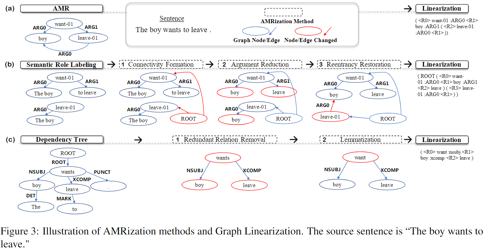

# ATP: AMRize Then Parse! Enhancing AMR Parsing with PseudoAMRs

[](https://paperswithcode.com/sota/amr-parsing-on-ldc2017t10?p=atp-amrize-then-parse-enhancing-amr-parsing)

[](https://paperswithcode.com/sota/amr-parsing-on-ldc2020t02?p=atp-amrize-then-parse-enhancing-amr-parsing)

Hi this is the source code of our paper "ATP: AMRize Then Parse! Enhancing AMR Parsing with PseudoAMRs" accepted by findings of NAACL 2022.

### News
 - 🎈 Release camera ready paper. [arXiv](https://arxiv.org/abs/2204.08875) 2022.04.20
 - 🎈 We have released four trained models and the test scripts. 2022.04.10

### Todos
 - 🎯 We are working on merging our training/preprocessing code with the amrlib repo. 

## Brief Introduction
TL;DR: SOTA AMR Parsing single model using only 40k extra data. **Rank 1st** model on Structrual-Related Scores (SRL and Reentrancy).

As Abstract Meaning Representation (AMR) implicitly involves compound semantic annotations, we hypothesize auxiliary tasks which are semantically or formally related can better enhance AMR parsing. With carefully designed control experiments, we find that 1) Semantic role labeling (SRL) and dependency parsing (DP), would bring much more significant performance gain than unrelated tasks in the text-to-AMR transition. 2) To make a better fit for AMR, data from auxiliary tasks should be properly ``AMRized'' to PseudoAMR before training. 3) Intermediate-task training paradigm outperforms multitask learning when introducing auxiliary tasks to AMR parsing. 

From an empirical perspective, we propose a principled method to choose, reform, and train auxiliary tasks to boost AMR parsing. Extensive experiments show that our method achieves new state-of-the-art performance on in-distribution, out-of-distribution, low-resources benchmarks of AMR parsing.


<div align=center>

</div>

## Requriments

Build envrionment for Spring
```bash
cd spring
conda create -n spring python=3.7
pip install -r requirements.txt
pip install -e .
# we use torch==1.11.0 and A40 GPU. lower torch version is fine.
```

Build envrionment for BLINK to do entity linking, Note that BLINK has some requirements conflicts with Spring, while the blinking script relies on both repos. So we build it upon Spring.
```bash
conda create -n blink37 -y python=3.7 && conda activate blink37

cd spring
pip install -r requirements.txt
pip install -e .

cd ../BLINK
pip install -r requirements.txt
pip install -e .
bash download_blink_models.sh
```
## Preprocess and AMRization

coming soon ~

## Training 

(cleaning code and data in progress)

```bash
cd spring/bin
```

- Train ATP-DP Task

```bash
python train.py --direction dp --config /home/cl/AMR_Multitask_Inter/spring/configs/config_dp.yaml
```

- Train ATP-SRL Task
```bash
python train.py --direction dp --config /home/cl/AMR_Multitask_Inter/spring/configs/config_srl.yaml 
# yes, the direction is also dp
```


- Train AMR Task based on intermediate ATP-SRL/DP Model

```
python train.py --direction amr --checkpoint PATH_TO_SRL_DP_MODEL --config ../configs/config.yaml
```

- Train AMR,SRL,DP Task in multitask Manner

```bash
python train.py --direction multi --config ../configs/config_multitask.yaml
```


## Inference

```bash
conda activate spring

cd script
bash intermediate_eval.sh MODEL_PATH 
# it will generate the gold and the parsed amr files, you should the change the path of AMR2.0/3.0 Dataset in the script.

conda activate blink37 
# you should download the blink models according to the ATP/BLINK/download_blink_models.sh in BLINK repo
bash blink.sh PARSED_AMR BLINK_MODEL_DIR

cd ../amr-evaluation
bash evaluation.sh PARSED_AMR.blink GOLD_AMR_PATH
```

## Models Release

You could refer to the inference section and download the models below to reproduce the result in our paper.

- ATP_SRL_AMR2.0 [Google Drive](https://drive.google.com/file/d/1MUJ6tW_0MY9SWAbRVEWXHzWYxx9nDx9W/view?usp=sharing)

```sh
#scores
Smatch -> P: 0.858, R: 0.844, F: 0.851
Unlabeled -> P: 0.890, R: 0.874, F: 0.882
No WSD -> -> P: 0.863, R: 0.848, F: 0.855
Concepts -> P: 0.914 , R: 0.895 , F: 0.904
Named Ent. -> P: 0.928 , R: 0.901 , F: 0.914
Negations -> P: 0.756 , R: 0.758 , F: 0.757
Wikification -> P: 0.849 , R: 0.824 , F: 0.836
Reentrancies -> P: 0.756 , R: 0.744 , F: 0.750
SRL -> P: 0.840 , R: 0.830 , F: 0.835
```

- ATP_SRL_D_AMR2.0 [Google Drive](https://drive.google.com/file/d/1sxKOjkkZ9MqveF6yMuMT5GfuvPVJcgKH/view?usp=sharing)

```sh
#scores
Smatch -> P: 0.859, R: 0.844, F: 0.852
Unlabeled -> P: 0.891, R: 0.876, F: 0.883
No WSD -> -> P: 0.863, R: 0.849, F: 0.856
Concepts -> P: 0.917 , R: 0.898 , F: 0.907
Named Ent. -> P: 0.942 , R: 0.921 , F: 0.931
Negations -> P: 0.742 , R: 0.755 , F: 0.749
Wikification -> P: 0.851 , R: 0.833 , F: 0.842
Reentrancies -> P: 0.753 , R: 0.741 , F: 0.747
SRL -> P: 0.837 , R: 0.830 , F: 0.833
```

- ATP_SRL_D_AMR2.0_Ensemble [Google Drive](https://drive.google.com/file/d/1cj216t9Qc1_D24f9Cs-jTv4z_fMPInER/view?usp=sharing)
```sh
#scores
Smatch -> P: 0.859, R: 0.847, F: 0.853
Unlabeled -> P: 0.891, R: 0.877, F: 0.884
No WSD -> -> P: 0.863, R: 0.851, F: 0.857
Concepts -> P: 0.917 , R: 0.899 , F: 0.908
Named Ent. -> P: 0.938 , R: 0.917 , F: 0.927
Negations -> P: 0.740 , R: 0.755 , F: 0.747
Wikification -> P: 0.849 , R: 0.830 , F: 0.840
Reentrancies -> P: 0.755 , R: 0.748 , F: 0.751
SRL -> P: 0.837 , R: 0.836 , F: 0.836
```

- ATP_SRL_AMR3.0_Ensemble [Google Drive](https://drive.google.com/file/d/1vtmkNVAZc8caPxAfwxn4pjvD4ll1uzjG/view?usp=sharing)
```sh
#scores
Smatch -> P: 0.844, R: 0.836, F: 0.840
Unlabeled -> P: 0.875, R: 0.866, F: 0.871
No WSD -> -> P: 0.849, R: 0.840, F: 0.845
Concepts -> P: 0.908 , R: 0.892 , F: 0.900
Named Ent. -> P: 0.900 , R: 0.879 , F: 0.889
Negations -> P: 0.734 , R: 0.729 , F: 0.731
Wikification -> P: 0.816 , R: 0.798 , F: 0.807
Reentrancies -> P: 0.729 , R: 0.749 , F: 0.739
SRL -> P: 0.822 , R: 0.830 , F: 0.826
```

## Acknowledgements
We thank all people/group that share open-source scripts for this project, which include the authors for [SPRING](https://github.com/SapienzaNLP/spring), [amrlib](https://github.com/bjascob/amrlib), [smatch](https://github.com/snowblink14/smatch), [amr-evaluation](https://github.com/mdtux89/amr-evaluation), [BLINK](https://github.com/facebookresearch/BLINK) and all other repos.

## Citation
If you feel our work helpful, please kindly cite

```bib
@misc{https://doi.org/10.48550/arxiv.2204.08875,
  doi = {10.48550/ARXIV.2204.08875},
  
  url = {https://arxiv.org/abs/2204.08875},
  
  author = {Chen, Liang and Wang, Peiyi and Xu, Runxin and Liu, Tianyu and Sui, Zhifang and Chang, Baobao},
  
  keywords = {Computation and Language (cs.CL), Artificial Intelligence (cs.AI), FOS: Computer and information sciences, FOS: Computer and information sciences},
  
  title = {ATP: AMRize Then Parse! Enhancing AMR Parsing with PseudoAMRs},
  
  publisher = {arXiv},
  
  year = {2022},
  
  copyright = {Creative Commons Attribution Non Commercial Share Alike 4.0 International}
}

```
